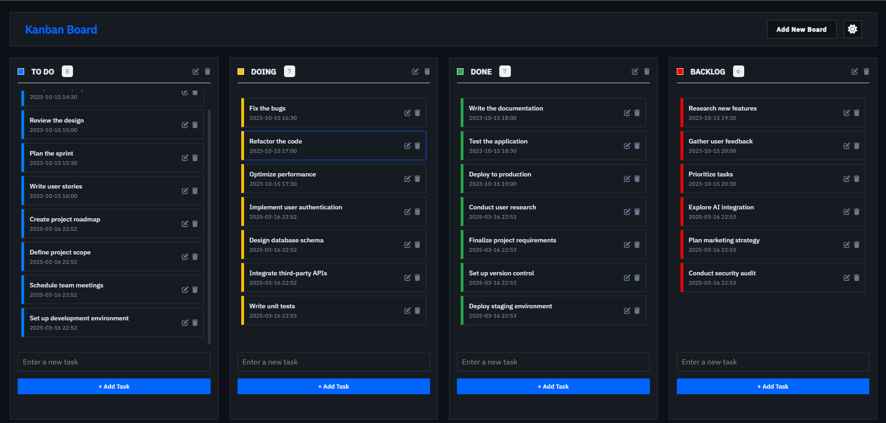

<h1 align="center">
  <br>
  Kanban Board Project
  <br>
</h1>

<div align="center">
  <a href="https://github.com/soumadip-dev">
    
  </a>
</div>

<h3 align="center">
  A simple and interactive Kanban Board built with JavaScript to manage tasks efficiently.
</h3>

---

## 📸 Preview

<div align="center">
  
</div>

---

## 🚀 Features

- 🕱️ **Drag-and-Drop Tasks**: Easily move tasks between boards (To Do, Doing, Done) using drag-and-drop functionality.
- ➕ **Add New Tasks**: Quickly add new tasks to any board with a simple input field.
- ✏️ **Edit and Delete Tasks**: Edit or delete tasks with just a click.
- 🎨 **Customizable Boards**: Create, edit, and delete boards with custom names and colors.
- 🎼 **Drag Sorting**: Reorder tasks within the same board using intuitive drag sorting.
- 🖼️ **Add New Board with Modal**: Use a modal popup to add new boards with a name and custom color.
- 🗂️ **Persistent Storage**: Save your tasks and boards locally using `localStorage`, so your data persists even after refreshing the page.
- 🌃 **Dark Mode**: Toggle between light and dark mode for a better user experience.
- 🗓 **Task Timestamps**: Each task includes a timestamp to track when it was created.
- 🗂️ **Task Count**: Automatically updates the number of tasks in each board.
- 🎯 **Interactive UI**: Smooth animations and intuitive design for a seamless user experience.
- 🔄 **Real-Time Updates**: Changes are reflected instantly without needing to refresh the page.

---

## 🛠️ Installation

Clone the repository:
```bash
git clone https://github.com/soumadip-dev/Kanban-Board-JS.git
cd Kanban-Board-JS
```

